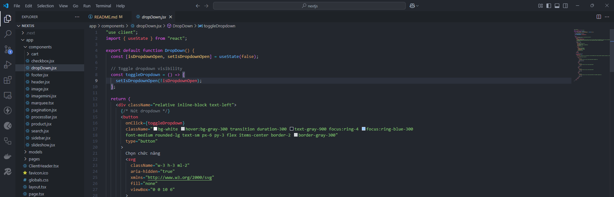
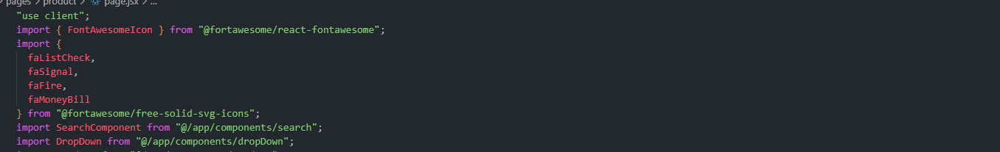
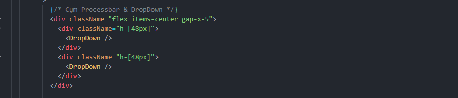

Đã deploy tất cả file và đường dẫn website là : (https://nextjs-boilerplate-sieumanh555s-projects.vercel.app/).

## Getting Started

First, run the development server:


Open [http://localhost:3000](http://localhost:3000) with your browser to see the result.

You can start editing the page by modifying `app/page.tsx`. The page auto-updates as you edit the file.

This project uses [`next/font`](https://nextjs.org/docs/app/building-your-application/optimizing/fonts) to automatically optimize and load [Geist](https://vercel.com/font), a new font family for Vercel.

## Learn More

To learn more about Next.js, take a look at the following resources:

- [Next.js Documentation](https://nextjs.org/docs) - learn about Next.js features and API.
- [Learn Next.js](https://nextjs.org/learn) - an interactive Next.js tutorial.

You can check out [the Next.js GitHub repository](https://github.com/vercel/next.js) - your feedback and contributions are welcome!

## Deploy on Vercel

The easiest way to deploy your Next.js app is to use the [Vercel Platform](https://vercel.com/new?utm_medium=default-template&filter=next.js&utm_source=create-next-app&utm_campaign=create-next-app-readme) from the creators of Next.js.

Check out our [Next.js deployment documentation](https://nextjs.org/docs/app/building-your-application/deploying) for more details.

## Đường dẫn thư mục

```
app/components/
```
- Là những trang nào được tái sử dụng nhiều thì nên tách ra các compoents thì tái sử dụng 

Ví dụ:

Compoent được dropDown cho tái sử dụng nhiều lần được:



Gọi compoent đó và phải đúng đường dẫn:



Gọi component đó vào trang cần gọi:

